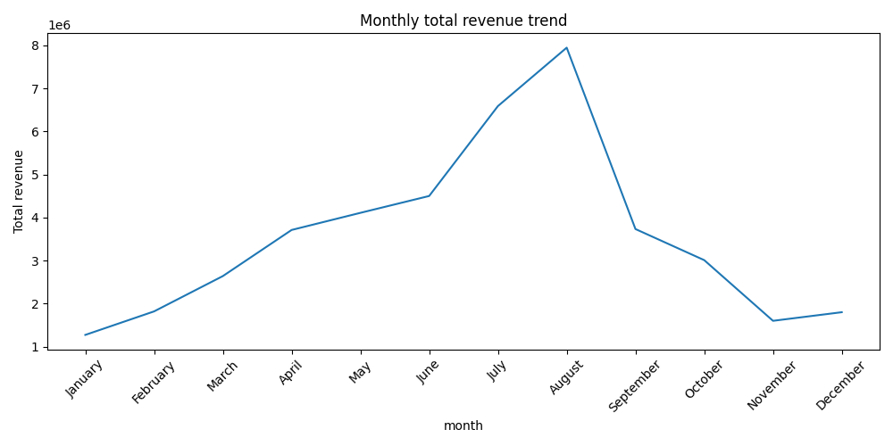
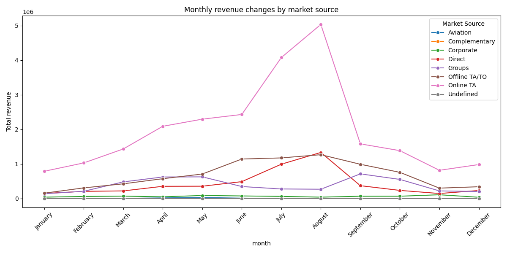
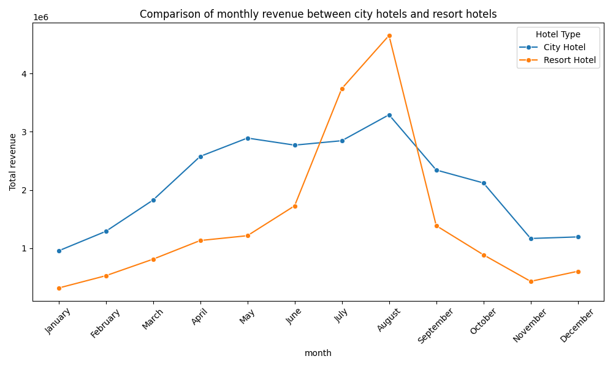

# 🏨 Hotel Booking Demand Analysis

本專案使用來自 [Kaggle: Hotel Booking Demand](https://www.kaggle.com/datasets/jessemostipak/hotel-booking-demand) 的資料集，進行以下兩大主題的數據分析：

1. **預測訂單是否會被取消**（分類模型）
2. **分析不同月份、不同市場來源的營收變化趨勢**

---

## 📂 專案內容說明

### 🔍 主題一：預測取消訂單（Classification）

使用 `RandomForestClassifier` 預測哪些預訂會被取消，幫助飯店提前預測潛在損失與資源調度：

- 選取特徵：
  - `lead_time`：提前訂房的天數
  - `adr`：平均每日房價
  - `market_segment`：市場來源
  - `is_repeated_guest`：是否為回訪旅客
  - `booking_changes`：訂單變更次數
- 模型評估結果（accuracy: **79%**）：

              precision    recall  f1-score   support

       0       0.81      0.86      0.84     14907
       1       0.74      0.67      0.71      8971

accuracy                           0.79     23878


---

### 📈 主題二：每月營收趨勢分析

分析飯店在不同月份、不同市場來源、不同類型（城市/渡假）之營收表現變化：

#### 📊 每月總營收變化



---

#### 🛫 各市場來源每月營收變化



---

#### 🏨 城市飯店 vs 渡假飯店 營收比較



---

## 🛠 使用套件（requirements.txt）

- pandas  
- matplotlib  
- seaborn  
- scikit-learn  

---

## 🚀 如何執行本專案

1. 確保已安裝 Python (建議版本 >=3.8)
2. 安裝必要套件：
    ```bash
    pip install -r requirements.txt
    ```
3. 放置 `hotel_bookings.csv` 到專案根目錄下
4. 執行 `analysis.py` 即可：

    ```bash
    python analysis.py
    ```

---

## 📎 資料來源

- Kaggle Dataset: [Hotel Booking Demand](https://www.kaggle.com/datasets/jessemostipak/hotel-booking-demand)
